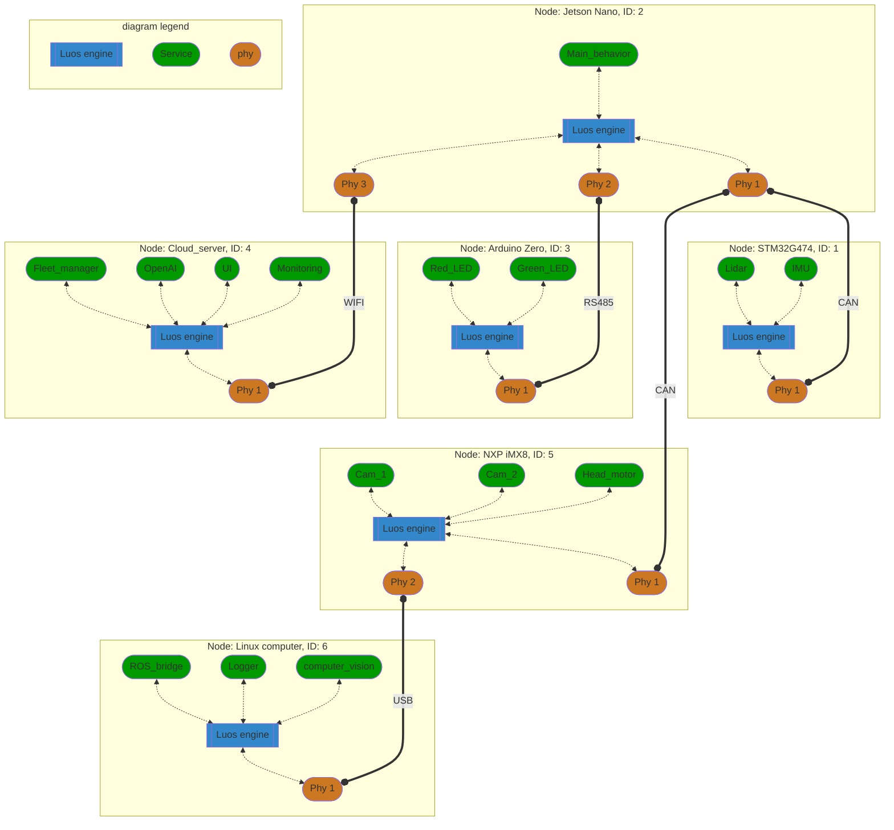

import useDocusaurusContext from '@docusaurus/useDocusaurusContext';
import Tooltip from '@site/src/components/Tooltip.js';
import Image from '@site/src/components/Image';
import IconExternalLink from '@theme/Icon/ExternalLink';

# Luos: Empowering Software to Overcome Hardware Limitations

When it comes to most embedded systems software, you'll often encounter a dominant paradigm known as the **"dictatorship of hardware"** 😈.

Sensors, actuators, and other hardware resources will be mixed into the application managing the behavior of the product into a unique and monolithic software. Modifying, or adding, hardware into such an architecture forces you to rethink the entire software project.

Most of the time, a device will have more than one computing unit (multiple microcontroller or a connectivity to a cloud for example). In this case, you will need to implement an inter-application communication protocol using any bus available, and you will need to deal with instructions, messaging, error handling, collision, priority, latency, etc. In this case, the product will be even more difficult to maintain due to a significant portion of time spent on the network software development across all the boards and softwares.

Luos is here to assist you in creating clean, seamless projects that can be developed, modified, and reused across a wide range of architectures. By liberating software from the dictatorship of hardware, Luos empowers developers to **overcome the limitations imposed by hardware** and facilitates efficient project management 😇.

Experience the power of Luos, where managing even the most complex product architectures becomes a breeze! With Luos, every feature (service) in your product is seamlessly accessible, controllable, and updatable.

As an example here a highly intricate architecture made possible by Luos, enabling direct access between any services:

## Introduction to Luos

**Luos is a simple and lightweight <a href="https://en.wikipedia.org/wiki/Microservices" target="_blank" rel="external nofollow">microservices<IconExternalLink width="10"></IconExternalLink></a> orchestrator dedicated to hardware products.** It is a powerful modularity tool to deploy, simplify, and link any hardware components or application codes as a <a href="https://en.wikipedia.org/wiki/Single_system_image" target="_blank" rel="external nofollow">single system image<IconExternalLink width="10"></IconExternalLink></a>.

This documentation contains all the basic notions you will need to use, create and understand Luos technology.

Luos is a low-level ANSI C lib you can use into every **bare metal** board's (<Tooltip def={useDocusaurusContext().siteConfig.customFields.node_def}>node</Tooltip>), **RTOS**, **OS**, or **cloud** app of your complete device. Luos will make all your services communicate together, no matter where they are in the network.

A Luos software architecture is composed of **code subdivisions** called <Tooltip def={useDocusaurusContext().siteConfig.customFields.service_def}>services</Tooltip>. Services are distributed across all <Tooltip def={useDocusaurusContext().siteConfig.customFields.node_def}>nodes</Tooltip> over the diferent networks used by your device.

  <Image
    sources={{
      light: '/assets/images/feature-service-package-node-board.png',
      dark: '/assets/images/luos-layers-white.png',
    }}
  />

## Introduction to embedded microservices

Luos empowers you with superpowers to streamline the development of your software and firmware. It achieves this by organizing your features into services and granting you the freedom to manage them as per your requirements.

With Luos, you gain the flexibility to deploy your services anywhere across any network supported by your Luos configuration. Regardless of their location in the architecture, you can access these services directly from anywhere. The dynamic addition and removal of services enable your applications to adapt to the available services on your device.

Finally, it doesn't matter what kind or how many different networks you need to use in your device; Luos will handle them and provide you with a consistent list of detected services across all of them. You can wire the different elements together as you want without any software constraints.
