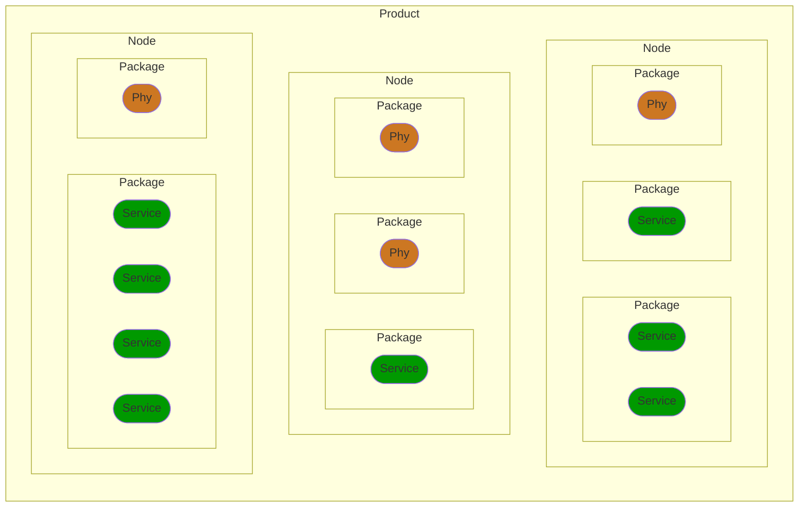

import Image from '@site/src/components/Image';

# Code organization

Because Luos engine allows you to manage your features as sharable blocks of code, we organized the code in a specific way allowing to easily integrate and share packages from your projects with as little friction as possible.

:::note
You can find a complete product example with custom service types, custom messages command as well as all the customization to easily take control of your device in the [product example of Luos_engine](https://github.com/Luos-io/luos_engine/tree/main/examples/projects/product).
:::

### Luos engine's levels

Different levels on the code projects are defined, corresponding to the different levels of information needed across your entire product.

|  Level  |                                              Description                                              |
| :-----: | :---------------------------------------------------------------------------------------------------: |
| Product | This is the place where you will have the configurations and information intended for all your nodes. |
|  Node   |  This is the executable's code. This is your actual Eclipse, PlatformIO, IAR, or any other project.   |
| Package |                   A sharable folder containing code files managing Services or Phy.                   |
| Service |    A Luos services can be drivers or apps. Each service manage a specific feature of the product.     |
|   Phy   |               A Phy is a network code allowing Luos to access other nodes and services.               |



### Product code organization with Luos

```AsciiDoc
 Project
  │
  ├─── product_config.h
  └─── Nodes
        ├─── Node_1
        │     ├─── node_config.h
        │     ├─── main.c
        │     └─── Packages
        │             ├─── Package_1
        │             │     ├─── package_1.c
        │             │     └─── package_1.h
        │             └─── Package_2
        │                   ├─── package_2.c
        │                   └─── package_2.h
        ├─── Node_2
        │     ├─── node_config.h
        │     ├─── main.c
        │     └─── Packages
        │             └─── Package_3
        │                   ├─── package_3.c
        │                   └─── package_3.h
        │
        └─── Node_3
                ├─── node_config.h
                ├─── main.c
                └─── Packages
                        ├─── Package_4
                        │     ├─── package_4.c
                        │     └─── package_4.h
                        ├─── Package_5
                        │     ├─── package_5.c
                        │     └─── package_5.h
                        └─── Package_6
                            ├─── package_6.c
                            └─── package_6.h

```

- **Product level**

  _product_config.h_: This file describes the general configuration for the product, such as baudrates, timeout duration, data format etc. It also groups the list of custom types, profiles, and commands your device need. This file is used by all the nodes of the same product and should be included at the node level.

- **Node level**

  _node_config.h_: This file describes the configuration of a node. This allows you to define some hardware specificities allowing you to properly run this executable such as board definition, buffer size for Luos to fit in RAM, or any other specificities needed by this particular program to run. In This file you will also include configurations allowing your packages to run properly.

  _main.c/.h_: The main files for the node that calls `Luos_Init`, `Luos_Loop` , initializes and calls the package (all the different `Package_Init`, `Package_Loop`).

- **Package level**

  _package.c/.h_: Contains the Service or Phy code. In these files, you can create services dedicated to your features or reference a physical transportation layer (Phy) using Luos API.

- **Service level**

  Uses Luos API and Service Profile in your package's code to create either a standard or a custom service that anybody can use.

- **Phy level**

  Uses Luos API to reference a specific transportation layer that will be used by Luos to exchange informations with other nodes.

### Where is Luos engine?

[Luos engine's library](../node/luos) is used at the [node](../node) level. You will need to initialize the engine and call a loop function in your main program to be able to use the Luos engine API in your packages.

<div align="center">
  <Image
    sources={{
      light: '/assets/images/luos_mcu_platform.svg',
      dark: '/assets/images/luos_mcu_platform-dark.svg',
    }}
  />
</div>
