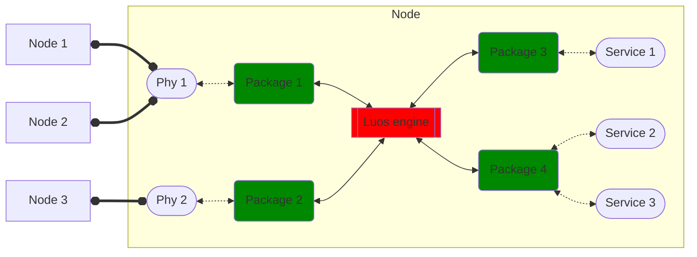

import useDocusaurusContext from '@docusaurus/useDocusaurusContext';
import Tooltip from '@site/src/components/Tooltip.js';
import Image from '@site/src/components/Image';
import IconExternalLink from '@theme/Icon/ExternalLink';

# Luos engine

Luos engine works as a code library running on nodes. It can use several network interfaces (phy).

To match the Luos engine's library with your hardware, it offers an <Tooltip def={useDocusaurusContext().siteConfig.customFields.luoshal_def}>Hardware Abstraction Layer</Tooltip> for various devices in the <a href="https://github.com/Luos-io/luos_engine/tree/main/engine/HAL" target="_blank" rel="external nofollow">Luos engine's HAL folder</a>.
There is also specific _Hardware Abstraction Layers_ for each phy network.

- <a href="https://github.com/Luos-io/luos_engine" target="_blank" rel="external nofollow">
    Luos engine
    <IconExternalLink width="10"></IconExternalLink>
  </a>
  : The main library you will be working with.

To make it work in your environment, you have to:

- Include the Luos engine's library folders in your project compilation;
- Include the right HAL for your device family;
- If necessary, overload HAL default configuration with a _node_config.h_ file describing specificities of your node. Luos engine's HAL provides default configurations for MCU families as examples, they can be modified to fit with your design (e.g. match pins with your design);
- Include _luos_engine.h_ in your main file.

The Luos engine's loop function needs to run constantly on each node.

The engine is like a task that has to be run regularly. The primary Luos engine's functions that should be called to be integrated into the embedded code of a node are `Luos_init()` and `Luos_loop()`. They should be added in the `main()` of your program.

Basically, your `main()` function will look like this:

```c
#include "luos_engine.h"

int main(void)
{
    Luos_Init();
    while(1)
    {
        Luos_Loop();
    }
    return 0;
}
```

It is now ready to host your services and phys by [running packages](../packages/index.mdx) on your main. By default Luos engine alone is only able to use localhost phys. To use other phys, you will need to explicitely add them.

**As a developer, you will always develop your functionalities into services and never into the `main()` program.**

:::note
The only information that should be put on the `main()` code are MCU's setup parameters Luos and packages' run functions.
:::

## A complete software node view

At the node level, communication is achieved by receiving and sending [messages](../messages/index.mdx) with the other [services](../services/index.mdx) of a given Luos architecture. The nodes can communicate with each other thanks to <Tooltip def={useDocusaurusContext().siteConfig.customFields.phy_def}>phys (physical network layers)</Tooltip>.

Luos engine will be able to find the physical destination to reach a specific service and define the best route to access it (a switch between all the phy such as localhost, Robus, CAN, or others).

:::info
You can use Luos engine on only one node. In this case you don't need to take care of the phys, the engine will only use localhost to exchange messages between you local services.
:::

Phy can encapsulate, control, and stores messages in the `msg_buffer` of your node. Depending on the specified destination and the type of each message, Luos will use the appropriate phy to reach the target.



## Node Parameters Configuration

Luos engine allows you to configure some parameters to optimize the memory usage and adapt it to fit your needs. To make it, we advise using a configuration file called _node_config.h_. Put the file at the root folder of your node project and add it in the compiling variables section of your IDE by adding the following line:

`#include node_config.h`

You can use it to set all your custom configurations to fit your design:

- for the services of your node
- for the phys of your node
- for the Luos engine of your node

|     Parameters           |    Defaults value     |                                                    Description                                                     |
| :-----------------------:| :-------------------: | :----------------------------------------------------------------------------------------------------------------: |
|   MAX_NODE_NUMBER        |          20           |     Max number of node that could be detected on the architecture.                                                 |
| MAX_SERVICE_NUMBER       |          20           |     Max number of services that could be detected in the architecture.                                             |
| MAX_LOCAL_SERVICE_NUMBER |           5           |                               Number of services in the node.                                                      |
| MAX_LOCAL_TOPIC_NUMBER   |          20           | Max number of pub/sub topics used by all the local services.                                                       |
| MAX_LOCAL_PROFILE_NUMBER | MAX_LOCAL_SERVICE_NUMBER | Max number of profiles used by all the local services.                                                          |
| LOCAL_PHY_NB             | 1                     | Max number of different network interface on the node.                                                          |
|  MSG_BUFFER_SIZE         |      3 \* max_msg_size      |         Size of the Luos message storage. Messages waiting to be treated or re-transmitted are stored in this buffer        |
|     MAX_MSG_NB           | 2 \* MAX_LOCAL_SERVICE_NUMBER |                        The max number of messages that can be referenced by Luos at the same time.                               |


You will find the default configuration for Luos engine in the file <a href="https://github.com/Luos-io/luos_engine/blob/main/engine/engine_config.h" target="_blank" rel="external nofollow">engine\_config.h<IconExternalLink width="10"></IconExternalLink>_</a>.

Check the _Luos_hal_config.h_ and your _Network_hal_config.h_ of your MCU family to see parameters that can be changed to fit your design.

> **Note:** [Every example](https://github.com/Luos-io/luos_engine/tree/main/examples/projects) provided by Luos has a _node_config.h_ file that can be used as a base to fit your project's needs.

## Luos Statistics

Into Luos embedded code, you are given the opportunity to obtain important information about different factors of the functioning of each node, as you can find stored several statistical values in the specific field of the structure that describes each node, like for example, the MCUs memory utilization, or timing information.

The statistics of a node can be occupied from any other node of the system, giving you the chance to explore the behavior of all your MCUs by having direct access to any of them.

More details of how to access the statistics are given in the [Monitoring tools page](../../tools/monitoring.mdx).
