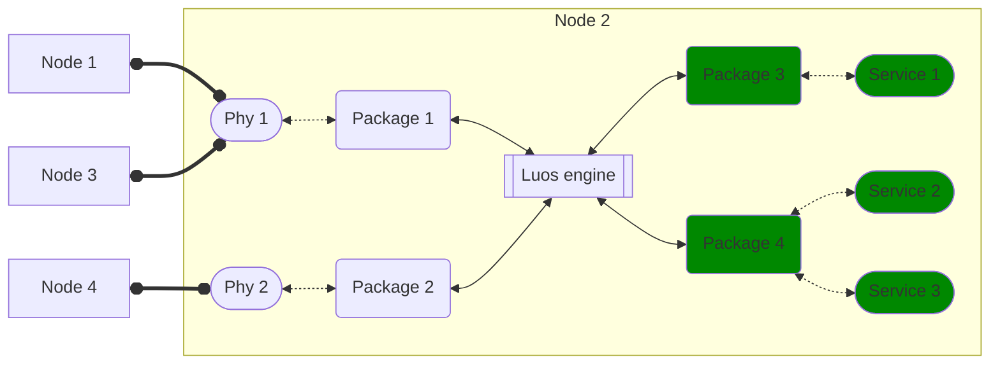

import useDocusaurusContext from '@docusaurus/useDocusaurusContext';
import Tooltip from '@site/src/components/Tooltip.js';

# Services

A service is a block of code which will provide functionality. Services are able to communicate with any other services present in the Luos network.

A service can be an [application](./create-services.mdx#apps-guidelines) or a [driver](./create-services.mdx#drivers-guidelines).

Each service provides a particular set of tasks such as managing a motor, handling a laser range finder, or more complex operations like computing an inverse-kinematics.

Each service is hosted in a single <Tooltip def={useDocusaurusContext().siteConfig.customFields.node_def}>node</Tooltip>, but a node can handle several services at the same time and manage communication between them and between other services hosted in other nodes, using the same network interface.

**As a developer you will always develop your functionalities into services, and never into the `main()` program.** The only information that should be put on the `main()` code are compute unit setup parameters and services' run functions.

## Service properties

To properly work, each service has some properties allowing other services to recognize and access it:

|   Name    |                                                                                                                                                                                                                                                                                         Description                                                                                                                                                                                                                                                                                         |                Format                 |
| :-------: | :-----------------------------------------------------------------------------------------------------------------------------------------------------------------------------------------------------------------------------------------------------------------------------------------------------------------------------------------------------------------------------------------------------------------------------------------------------------------------------------------------------------------------------------------------------------------------------------------: | :-----------------------------------: |
|  **ID**   |                                                                                The ID is a unique number given to each service depending on their physical position. The system automatically assigns each ID during the [detection phase](./routing-table.mdx). If you move a service from a microcontroller A to a microcontroller B on a given device, the ID will change. In the same way, if you change the wiring order of a microcontroler on the network on a given device, the ID will change too.                                                                                 |       Integer e.g. `Id=1`        |
| **TYPE**  |                                                                                                                                                                                The type defines the service purpose. A few types are predefined and can be used, or new ones can be created. The service type can't be changed after service initialization. See [Type](./types.mdx) for more informations.                                                                                                                                                                                 | String e.g. `type=DISTANCE_TYPE` |
| **ALIAS** | Alias is the name of the service. It's used to easily identify a service. Each service has a **default alias** which can be changed by users. For example, a service with the default alias `motor_mod` can be named `left_knee_motor` by user. This new name will be stored in the non-volatile memory of the board. As we don't want to have multiple services with the same name, a duplicate name on your system will be automatically assigned with an incrementing number at its end, in the network. You can go back to the default name by setting a void name (`""`) to a service. |    String e.g. `alias="gate"`    |
