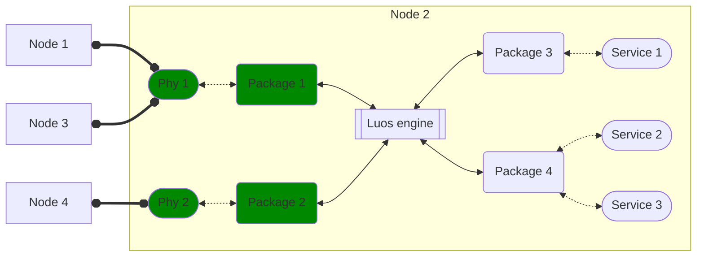

import useDocusaurusContext from '@docusaurus/useDocusaurusContext';
import Tooltip from '@site/src/components/Tooltip.js';

# Phy

A "phy" (physical interface) is a package that enables the Luos engine to extend its architecture through a network. Phys add specific network capabilities to the Luos engine, allowing nodes to be detected and communicate together within the same network. Choosing the appropriate phy is crucial for your application, considering factors such as application requirements, environmental conditions, constraints, and hardware compatibility.

The flexibility of Luos allows you to integrate as many phys as needed into the engine, enabling the use of different networks within the same application. While some phys already exist and can be directly used in your application, you also have the option to create your own phy by following the [phy creation guide](phy/create_phy).

:::note
Creating reusable phys is a community effort, and if you wish to share your phy with the Luos community, you can add it to the platformio registry. Feel free to contact us through [Discord](https://discord.gg/luos) if you have any questions and to have it included in the Luos documentation.
:::

It's important to note that creating a phy is a relatively challenging task that demands strong programming skills and a deep understanding of both the Luos engine and the network for which you are developing the phy. For guidance, you can refer to the [existing phys](https://github.com/Luos-io/luos_engine/tree/main/network) as examples and inspiration.

By following these guidelines and leveraging the community's expertise, you can design a well-suited phy that seamlessly integrates with Luos and meets your specific network requirements.
